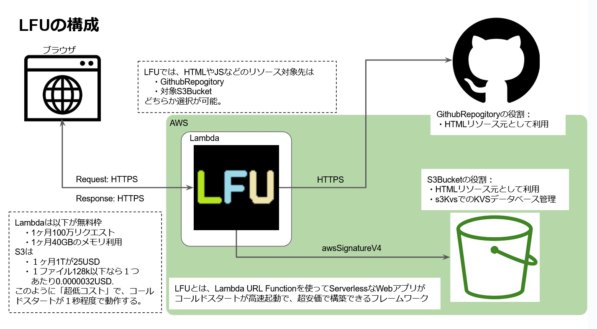
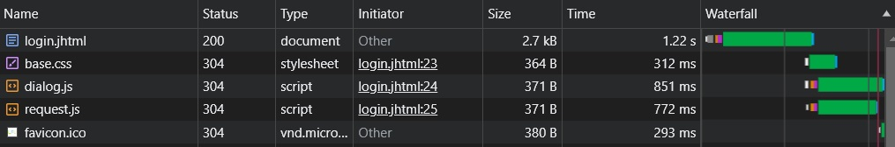
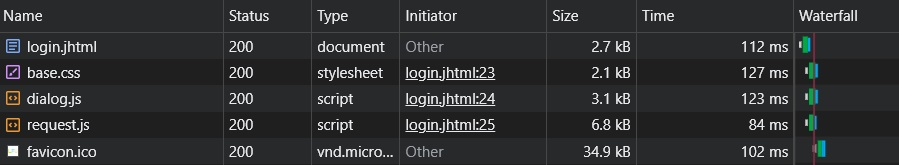

# LFUとは

LFUはAWS Lambda で提供されている機能 `関数URL` を使った「小規模」なWebアプリ環境を「超低コスト」且つ「高速コールドスタート」可能なフレームワークです。 

このようにLFUは「超低コスト」を目指すserverlessなnode.jsベースのWebアプリフレームワークです。

## AWSでWebアプリを実現する場合の最低構成とコスト.

通常AWSで最小環境のWebアプリサーバーを構築する場合は以下の環境の必要性が求められます。

※ 1USD = 150円計算.
- EC2(t2.micro) 
  1,963 円/月
- RDS(MySQL, db.t3.micro, ストレージ:10G) 
  3,059 円/月
- Route53(ドメイン)

最低限の環境でも１ヶ月の運用コストが
> 5,022円/月

かかる計算となります。

社内システムの場合は「営業時間外は停止」することも考慮した場合（１日１２時間ぐらいを実行対象とした場合でも
> 2,511円/月

のコストが毎月かかることになります。

## LFUでWebアプリを実現した場合.

一方LFUで構築したWebアプリの場合

- 1ヶ月100万リクエスト
- 1ヶ月40GBのメモリ利用

これが毎月の「無料枠」になるので、通常なら上が超過しない場合は「無料」となります。

一方で超過した場合でも

- 1リクエスト: 0.0000002 USD/リクエスト
- メモリ利用: 0.00001667 USD/GB 秒

となっており、仮に `1日動かし続けた場合のメモリーコスト` の場合は

- 128MByte = 0.18436USD
- 256MByte = 0.36871USD
- 512MByte = 0.73742USD
- 1024MByte = 1.47485USD
- 10240MByte(MAXメモリ指定) = 14.7485USD

と非常に安価となっています。 
　※ 10240MByte の選択は普通やらないので `参考値` となります。

またLFUではRDSの代わりにS3をKVS的な利用を行うことでデータベース的利用としており、このときの１行あたりのコストが大体
- 0.0000032USD 
  日本円にして `0.00047円` のコスト

となるので、100万行の情報を管理したとしても
> 470円/月

のコストとなります。

## LFUのコールドスタートとウォームスタートについて

LFUのテスト用サイト[GithubRepogitory](https://github.com/maachang/testLFU)の内容から、ログイン画面を見たときのLambaコールドスタート実行での速度が以下のようになっています。

体感的だと表示までに約２秒程度と、それほど「耐えられない」ほどの速度ではないかと思います。

もちろんLambdaウォームスタートの場合は、通常のWebアプリ程度の速度でレスポンスされます。

このように LFG では、非常に高速なコールドスタートを実現しています。

## 興味のある方は以下チュートリアル資料を見て、LFUの超安価なWebアプリの実装を体験してください

※ チュートリアルはこれから記載していく予定。

